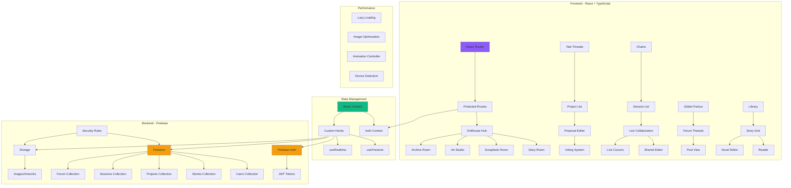

# 🕯️ GRIMOIRE: Tale Threads

[](https://opensource.org/licenses/MIT)
[](https://github.com/{{YOUR_USERNAME}}/grimoire-tale-threads/actions)
[](https://kiro.ai)

> A gothic storytelling platform combining nostalgia, modern UX, and collaborative narrative creation — built with Kiro AI-assisted development.

**Live Demo:** [{{DEMO_URL}}]({{DEMO_URL}})  
**Category:** Costume Contest (with Frankenstein elements)

---

## 📖 Table of Contents

- [About](#about)
- [How Kiro Was Used](#how-kiro-was-used)
- [Architecture](#architecture)
- [Features](#features)
- [Tech Stack](#tech-stack)
- [Getting Started](#getting-started)
- [Testing](#testing)
- [Deployment](#deployment)
- [For Judges](#for-judges)
- [License](#license)

---

## 🎭 About

GRIMOIRE is a responsive web-based storytelling platform inspired by early-2000s web aesthetics, digital diaries, and interactive fiction. Users explore a virtual "Dollhouse" environment containing:

- **Personal Diary** with mood tracking and encryption
- **Scrapbook** with vintage polaroid effects
- **Art Studio** with MS Paint-style tools
- **Tale Threads** — collaborative story editing with proposal voting
- **Chains** — reflection sessions with live cursors
- **Gilded Parlour** — gothic forum discussions
- **Library** — read and write stories with atmospheric effects

The interface responds to user behavior: tab switching, cursor inactivity, writing focus, and page exit trigger subtle animations and environmental changes.

---

## 🤖 How Kiro Was Used

### Vibe Coding
**Strategy:** Close-ended questions for precision.  
Instead of "How can I optimize the diary feature?" I asked: "Refactor DollhouseRoom to lazy-load images? Yes or No" or "Should SharedEditor batch Firestore writes? Yes or No."

**Most Impressive Contributions:**
- Refactored Dollhouse system with lazy loading and reduced re-renders
- Generated behavioral triggers for tab switches, cursor inactivity, idle animations
- Automated test suites for scrapbook uploads and collaborative writing
- Optimized Three.js render logic for lower-end devices

### Agent Hooks
Automated workflows throughout development:
- **Component Loading:** Auto-loaded room components, set default states, preloaded assets
- **Behavioral Triggers:** Managed tab switching, cursor inactivity, idle states automatically
- **Scrapbook Automation:** Pre-processed uploads, generated vintage frames, synced Firebase edits
- **Performance Monitoring:** Tracked component performance, deferred heavy renders
- **Testing:** Generated test scaffolds and batch validation

**Impact:** Consistency, speed, and maintainability across 200+ components.

### Spec-Driven Development
Structured specifications in `.kiro/specs/`:
- **Feature Specs:** Haunted Diary Spec, Scrapbook Flow Spec, Room Interaction Rules
- **Trigger Definitions:** Cursor inactivity, tab switching, idle animations
- **Component Responsibilities:** Props, side effects, interdependencies

**Benefits:** Precision, consistency, traceability, faster iteration.

### Steering Docs
Context preservation across sessions via `.kiro/steering.md`:
- High-level architectural context
- Granular behavioral rules per component
- Alignment with tone, logic, and technical constraints

**Most Effective Strategy:** Layered steering — broad system logic + fine-grained interactions.

### MCP (Model Context Protocol)
Extended Kiro capabilities for:
- **Systematic Refactoring:** Applied improvements across hundreds of components
- **Test Generation:** Created and validated behavioral trigger tests
- **Documentation Sync:** Kept `.kiro` folder aligned with code changes
- **Performance Analysis:** Identified bottlenecks, suggested lazy-loading
- **Error Handling:** Applied consistent patterns across Firebase operations

**Workflow Improvements:** Parallel task processing, architectural consistency, reliable scaling.

---

## 🏗️ Architecture



### Security Boundaries

- **Authentication:** Firebase Auth with JWT tokens
- **Authorization:** Firestore security rules enforce user permissions
- **Data Validation:** Client-side + server-side validation
- **Rate Limiting:** Implemented in security middleware
- **Encryption:** Diary entries encrypted client-side before storage
- **FIPPA Compliance:** User data handling follows privacy regulations

---

## ✨ Features

### 🏚️ Dollhouse Environment
- Virtual rooms representing different content types
- Smooth transitions with curtain animations
- Responsive to user behavior (idle, tab switch, cursor movement)

### 📔 Diary System
- Encrypted personal entries with mood tracking
- Vintage typewriter aesthetic
- Auto-save with visual indicators
- Focus mode for distraction-free writing

### 📸 Scrapbook
- Vintage polaroid effects and filters
- Drag-and-drop upload
- Sticker picker and scratch-off secrets
- Investigation board mode with red string connections

### 🎨 Art Studio
- MS Paint-inspired interface
- Custom brushes with haunted effects
- Canvas distortions and glitch effects
- Gallery with masonry layout

### 🧵 Tale Threads (Collaborative Stories)
- Create projects with permission models
- Submit proposals for story changes
- Voting system with integrity index
- Diff engine shows changes
- Merge approved proposals

### ⛓️ Chains (Reflection Sessions)
- Real-time collaborative editing
- Live cursor tracking
- Shared scrapbook
- Participant presence indicators

### 🕯️ Gilded Parlour (Forum)
- Gothic library aesthetic
- Threaded discussions
- Candle-based likes
- Content moderation tools

### 📚 Library
- Read and write stories
- Genre-based atmospheric effects
- Bookmark and quote saving
- Torch lighting effects
- Reading history tracking

---

## 🛠️ Tech Stack

- **Frontend:** React 18, TypeScript, Vite
- **Styling:** TailwindCSS, Framer Motion
- **Backend:** Firebase (Auth, Firestore, Storage)
- **Testing:** Vitest, Playwright, React Testing Library
- **CI/CD:** GitHub Actions
- **Deployment:** Vercel (primary), Netlify/Cloud Run (alternatives)
- **Development:** Kiro AI (vibe coding, hooks, specs, steering, MCP)

---

## 🚀 Getting Started

### Prerequisites

- Node.js 18+ and npm/pnpm
- Firebase account
- Git

### Installation

1. **Clone the repository:**
   ```bash
   git clone https://github.com/{{YOUR_USERNAME}}/grimoire-tale-threads.git
   cd grimoire-tale-threads
   ```

2. **Install dependencies:**
   ```bash
   pnpm install
   ```

3. **Set up environment variables:**
   ```bash
   cp .env.example .env
   ```
   
   Edit `.env` and add your Firebase credentials:
   ```env
   VITE_FIREBASE_API_KEY=your_api_key_here
   VITE_FIREBASE_AUTH_DOMAIN=your_auth_domain
   VITE_FIREBASE_PROJECT_ID=your_project_id
   VITE_FIREBASE_STORAGE_BUCKET=your_storage_bucket
   VITE_FIREBASE_MESSAGING_SENDER_ID=your_sender_id
   VITE_FIREBASE_APP_ID=your_app_id
   ```

4. **Deploy Firestore rules and indexes:**
   ```bash
   firebase deploy --only firestore:rules,firestore:indexes
   ```

5. **Start development server:**
   ```bash
   pnpm dev
   ```

6. **Open browser:**
   Navigate to `http://localhost:5173`

---

## 🧪 Testing

### Run All Tests
```bash
pnpm test
```

### Unit Tests Only
```bash
pnpm test:unit
```

### E2E Tests (Headless)
```bash
pnpm test:e2e
```

### E2E Tests (UI Mode)
```bash
pnpm test:e2e:ui
```

### Linting
```bash
pnpm lint
```

### Type Checking
```bash
pnpm type-check
```

---

## 📦 Deployment

### Vercel (Primary)

1. **Install Vercel CLI:**
   ```bash
   npm i -g vercel
   ```

2. **Deploy:**
   ```bash
   pnpm deploy:vercel
   ```

3. **Set environment variables in Vercel dashboard**

### Netlify (Alternative)

```bash
pnpm deploy:netlify
```

### Google Cloud Run (Alternative)

```bash
pnpm deploy:cloudrun
```

See [DEPLOYMENT.md](./DEPLOYMENT.md) for detailed instructions.

---

## 👨‍⚖️ For Judges

### Testing the Live Demo

**Demo URL:** [{{DEMO_URL}}]({{DEMO_URL}})

**Test Credentials:**
- **Username:** `judge@grimoire.test`
- **Password:** `JudgeDemo2024!`

### Step-by-Step Demo Script

See [demo-script.md](./demo-script.md) for a complete walkthrough.

**Quick Test Flow:**
1. Log in with test credentials
2. Navigate to Dollhouse → Diary → Create entry
3. Visit Tale Threads → Create project → Submit proposal → Vote
4. Explore Chains → Create session → Invite participant
5. Check Gilded Parlour → Browse threads → Post comment
6. Visit Library → Read story → Save quote

### Running Locally

Follow [Getting Started](#getting-started) instructions above.

**Note:** You'll need your own Firebase project. See [TESTING_INSTRUCTIONS.md](./TESTING_INSTRUCTIONS.md).

### Verifying Kiro Usage

The `.kiro/` directory at the project root contains:
- **specs/** — Feature specifications used for development
- **hooks/** — Agent hook configurations
- **steering.md** — Steering document for context preservation
- **README.md** — Detailed explanation of Kiro usage

**CI Check:** Our GitHub Actions workflow fails if `.kiro/` is missing.

### Security

See [SECURITY.md](./SECURITY.md) for details on:
- How secrets are managed
- GitHub Secrets configuration
- Safe local testing
- No secrets in repository

---

## 📄 License

This project is licensed under the **MIT License** — see the [LICENSE](./LICENSE) file for details.

**Alternative:** To use Apache-2.0 instead, replace LICENSE file with Apache-2.0 text and update this badge.

---

## 🙏 Acknowledgments

- Built with [Kiro AI](https://kiro.ai) — AI-assisted development platform
- Inspired by early-2000s web aesthetics and interactive fiction
- Gothic design elements from public domain sources
- Copyright-free book covers from Project Gutenberg

---

## 📞 Contact

**Maintainer:** {{YOUR_NAME}}  
**Email:** {{YOUR_EMAIL}}  
**GitHub:** [@{{YOUR_USERNAME}}](https://github.com/{{YOUR_USERNAME}})

---

**Built for the Kiro Hackathon 2024** 🎃
